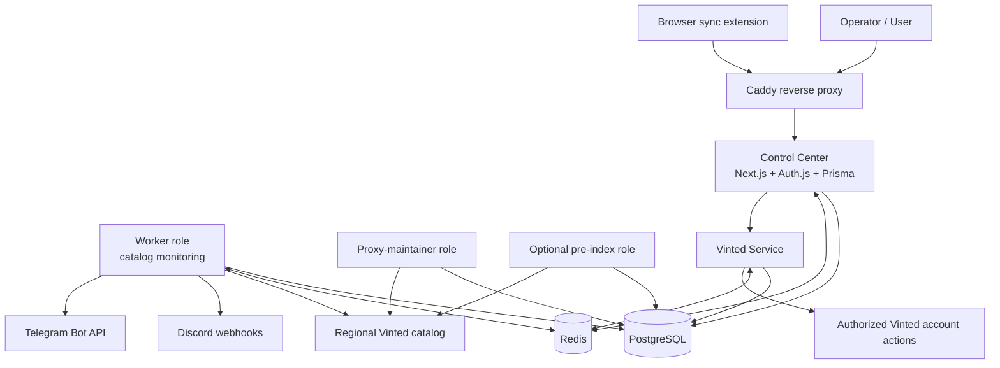
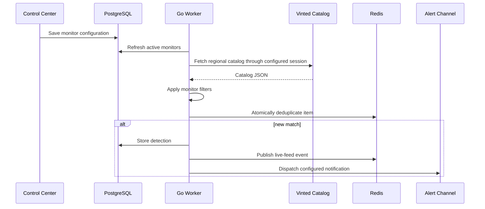

# Architecture

Vintrack is a Docker Compose monorepo with a web control plane, Go data-plane
services, and shared PostgreSQL and Redis infrastructure.

## System view

## Components

### Control center

`apps/control-center` owns:

- the public landing and authenticated dashboard;
- Discord OAuth and optional OIDC authentication;
- monitor, proxy group, account, and administration APIs;
- Prisma schema and forward database migrations;
- the server-sent-events feed;
- the browser extension integration endpoints.

The host binds the container to `127.0.0.1:3000`; Caddy is the intended public
entry point.

### Worker

`apps/worker` runs multiple roles from the same image:

- `monitor` reads monitor configuration, fetches catalog pages, matches listings,
  deduplicates results, persists detections, and dispatches alerts;
- `proxy-maintainer` imports, validates, promotes, cools down, and retires shared
  proxies while performing bounded retention cleanup;
- `id-scanner` is an optional shadow experiment and never emits user alerts.

Catalog clients keep bounded pools and regional session state. Requests are
performed through configured proxy routes with an explicit TLS client profile.

### Vinted service

`apps/vinted-service` is separate from monitoring. It handles actions for an
explicitly linked account, including session validation, likes, offers,
messages, and checkout-link support.

Separation limits the amount of authenticated session logic inside the catalog
worker and keeps shared free proxies away from account actions.

### PostgreSQL

PostgreSQL is the source of truth for users, monitors, detections, proxy state,
linked-session records, and operational history. Prisma migrations are applied
by the one-shot `control-center-migrate` service before dependent services start.

### Redis

Redis provides low-latency coordination for cache entries, deduplication,
session-adjacent state, and live-feed publication. It is not a replacement for
the persistent database.

## Detection flow

## Trust boundaries

- **Public edge:** Caddy terminates public HTTP(S) before forwarding to the
  control center.
- **User identity:** Discord or OIDC assertions create application sessions;
  roles determine application access.
- **Linked accounts:** session material is encrypted before database storage
  using `VINTED_SESSION_ENCRYPTION_KEY`.
- **Notification credentials:** Discord webhook URLs and the Telegram bot token
  are secrets and must not appear in source, logs, or issue reports.
- **Proxy credentials:** static proxy files and user groups may contain
  credentials and must remain outside version control.
- **Third-party boundary:** Vinted, Discord, Telegram, proxy providers, and
  identity providers have independent availability, policies, and terms.

## Operational principles

- Apply committed migrations forward; do not use destructive schema pushes.
- Keep both encryption secrets stable and backed up.
- Use bounded concurrency and retention.
- Treat free proxy capacity as volatile.
- Keep database and Redis host ports loopback-only unless the deployment has a
  deliberate private network.
- Review account actions separately from public catalog monitoring.

For exact deployment values, see [Configuration](configuration.md). For local
component workflows, see [Development](development.md).
