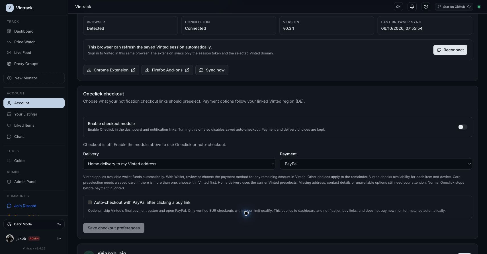

# Per-user checkout module

Account → Oneclick checkout → **Enable checkout module** is a persistent master
switch for both normal Oneclick and saved PayPal/card auto-checkout. The module
starts **off for all existing and new users**. Enabling it opens the mandatory
risk dialog, requires server-recorded acceptance, and respects administrator
feature policies and the linked-account requirement.

Turning it off keeps delivery and payment choices but removes the saved
`autoCheckout` opt-in. Turning it back on leaves auto-payment off; the user must
explicitly enable it again, accept its warnings and save a spending limit.
The switch saves immediately; the separate Save button saves checkout choices.

When off:

- Dashboard cart buttons are disabled.
- New Discord/Telegram alerts omit the checkout link.
- Existing links and legacy buy/warm/history routes fail closed.
- Vinted service checkout routes independently enforce the persisted switch.
- A concurrently saving preferences request cannot rearm a disabled module.

An already running checkout or payment cannot be undone by this switch. Check
Vinted for the outcome of a request that started before disabling the module.
The extension itself remains available for session sync and other account tools.

## Deployment

Apply Prisma migration `20261006120000_add_user_checkout_switch` **before**
starting the updated control-center, worker and vinted-service. It adds
`User.checkout_enabled BOOLEAN NOT NULL DEFAULT false`; there is no automatic
opt-in or consent backfill. No extension release is needed for this change.

The switch is read alongside existing user policy/preferences queries. The
handoff reads current access when it becomes visible or is retried,
so an old hidden tab cannot use stale enabled settings. The ordinary flow still
loads the target once, in parallel with extension detection; there are no added
Vinted requests.

## Validation

Frontend unit tests cover opt-in/auth/admin/consent enforcement, disabling,
auto-payment reset, stale settings writes and notification target denial.
The optional Go integration test checks default-off and repeated transitions
against PostgreSQL using a temporary synthetic member, without contacting Vinted:

```sh
cd apps/vinted-service
CHECKOUT_MODULE_INTEGRATION_DATABASE_URL=... go test ./internal/session -run TestCheckoutModuleAccessAgainstPostgres -v
```

Local Account UI: the enable switch opens the risk modal; cancelling leaves the
module off. No real member consent, auto-payment or Vinted checkout was submitted.


